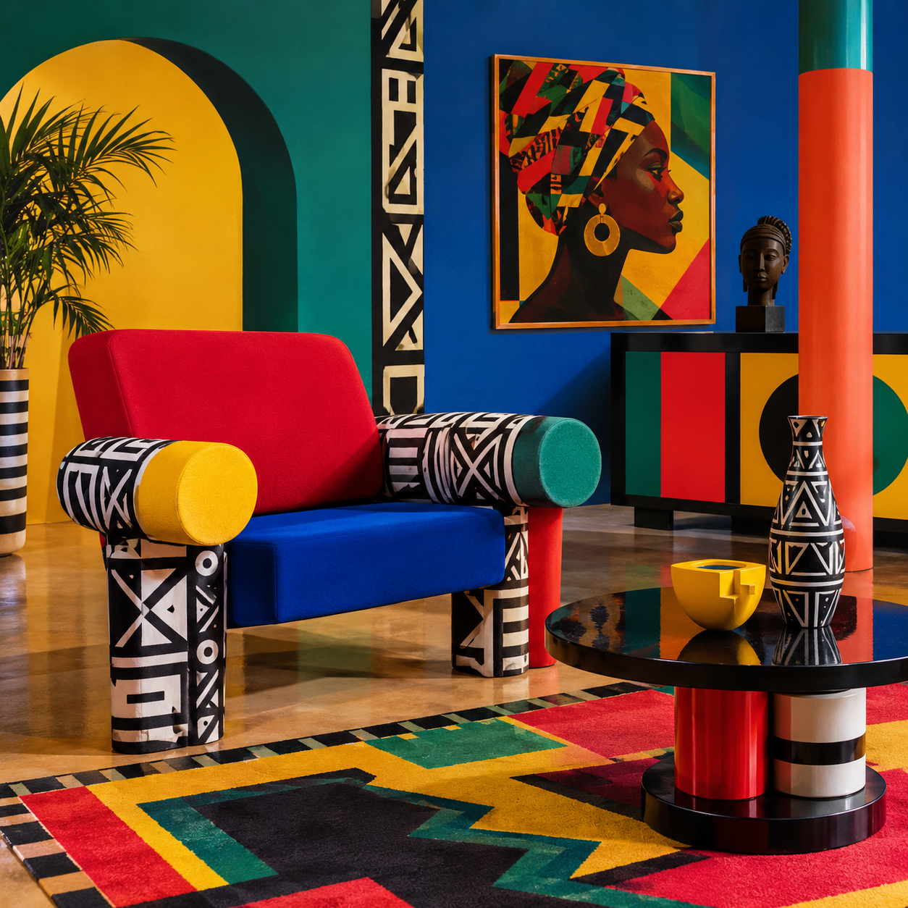
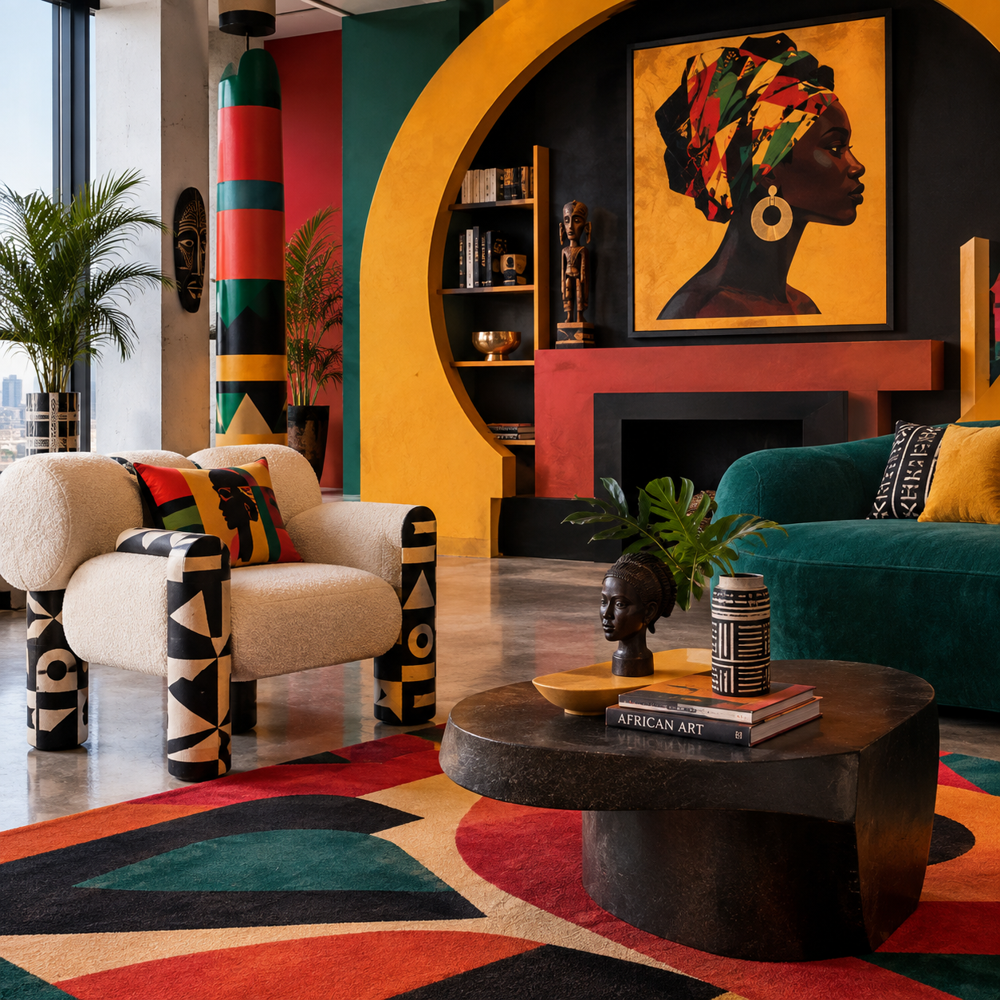

# Afro-postmodern Design

## Historical Background

Afro-postmodern Design combines ideas associated with Postmodern design with African and African-diaspora cultural references. It can be understood as a design approach that uses cultural imagery, bold visual elements, historical references, and contemporary influences rather than following one universal design system.

Postmodern design developed partly as a reaction against the simplicity and strict rules associated with Modernism. Postmodern designers were more willing to combine different historical references, decorative elements, colors, and cultural influences.

A closely related and better-documented movement is Afrofuturism. The Smithsonian's National Museum of African American History and Culture describes Afrofuturism as an evolving concept that reimagines, reinterprets, and reclaims the past and present while imagining more empowering futures for Black communities. It appears across art, fashion, music, film, literature, and visual media.

## Main Characteristics

Afro-postmodern Design can include:

- Bold and expressive colors
- Geometric and repeating patterns
- African and African-diaspora cultural references
- Mixing traditional and contemporary imagery
- Layered or complex compositions
- Decorative elements
- Strong visual contrast
- Symbolic imagery
- Mixing historical references with modern technology or popular culture

These characteristics connect with Postmodernism's willingness to combine different visual languages instead of following one strict design system.

## How Afro-Postmodern Challenges Modernist Design

Modernist design often emphasized simplicity, functionality, order, and universal visual systems.

Afro-postmodern approaches can challenge these ideas by bringing cultural identity, symbolism, decoration, historical references, and expressive visual elements into the design.

Rather than relying on a single universal visual language, the design can combine different cultural and historical references. This reflects a broader Postmodern approach to mixing styles and questioning established design rules.

Afrofuturism provides a related example of this approach. The Smithsonian describes Afrofuturism as using art, creative works, and activism to express Black identity, agency, and freedom while imagining liberated futures for Black life.

## When and Why Afro-Postmodern Design Is Used

This approach can be useful when a designer wants to:

- Express cultural identity
- Connect historical and contemporary ideas
- Create visually distinctive work
- Use symbolism and storytelling
- Combine traditional references with modern technology
- Challenge conventional design expectations
- Create designs centered on Black experiences and perspectives

## Practical Design Guidance

### Imagery

Use imagery that connects cultural history with contemporary or futuristic ideas. Possible visual elements include:

- Geometric patterns
- Repeated motifs
- Cultural symbols
- Portraiture
- Futuristic technology
- Space imagery
- African-inspired visual references
- Layered photographs and illustrations

Cultural symbols should be used with context and respect rather than as generic decoration.

### Colors

Possible color approaches include:

- Strong contrasting colors
- Earth tones combined with brighter colors
- Gold and metallic colors
- Deep blues and purples
- Red, yellow, and green combinations
- Futuristic neon colors when using Afrofuturist influences

### Typography

Typography can be expressive while remaining readable. Designers can combine:

- Bold display typefaces
- Geometric sans-serif fonts
- Large headings
- Contrasting type sizes
- Layered or experimental typography

### Layout

Layouts can use:

- Asymmetry
- Layering
- Overlapping elements
- Repeated patterns
- Strong geometric structures
- Contrasting sections
- A mixture of traditional and contemporary visual references

## Images

### Afro Postmodern Interior

*AI-generated visual reference showing bold colors, geometric patterns, sculptural furniture, and Afrocentric decorative elements.*

### Afro Postmodern Lounge

*AI-generated visual reference showing Afrocentric artwork, geometric forms, bold colors, and Postmodern interior design.*

## Real-World Examples

### Nona Hendryx's Afrofuturist Costume, 1975

Nona Hendryx of Labelle wore a futuristic costume designed by Larry LeGaspi during a 1975 performance on *The Midnight Special*. The Smithsonian National Museum of African American History and Culture identifies the costume as part of its Afrofuturism collection.

The costume uses metallic materials, geometric details, and futuristic forms, demonstrating how Black cultural expression and futuristic visual ideas can be combined.

**Creator:** Larry LeGaspi  
**Date:** 1975  
**Worn by:** Nona Hendryx of Labelle  
**Institution:** National Museum of African American History and Culture, Smithsonian Institution

### Afrofuturism: A History of Black Futures Exhibition, 2023–2024

The Smithsonian's National Museum of African American History and Culture presented *Afrofuturism: A History of Black Futures*, an exhibition that explored Afrofuturist expression through music, film, fashion, literature, visual art, and other forms of creative work.

The exhibition included more than 100 objects and demonstrated how Black artists and creators have used technology, science fiction, history, and cultural traditions to imagine different futures.

**Institution:** National Museum of African American History and Culture  
**Exhibition:** *Afrofuturism: A History of Black Futures*  
**Dates:** March 24, 2023 – August 18, 2024

## Why Afro-Postmodern Is Postmodernist

Afro-postmodern Design can be connected to Postmodernism because it allows multiple visual references and cultural influences to exist together.

It can combine historical imagery, contemporary design, popular culture, technology, decoration, and cultural identity instead of following the strict simplicity associated with Modernism.

The relationship is especially visible through Afrofuturist work, which reinterprets history and combines cultural traditions with futuristic and technological ideas.

## Sources

- [Smithsonian National Museum of African American History and Culture — Afrofuturism](https://nmaahc.si.edu/explore/exhibitions/afrofuturism)
- [Smithsonian National Museum of African American History and Culture — Afrofuturism Explained](https://nmaahc.si.edu/explore/stories/afrofuturism-explained)
- [Smithsonian Institution — Afrofuturism](https://www.si.edu/spotlight/afrofuturism)
- [Smithsonian National Air and Space Museum — Afrofuturism](https://airandspace.si.edu/explore/stories/afrofuturism)

## Image Credits

Both images on this page were generated with AI for this project as visual references. They are not photographs of existing interiors or artworks.

[Back to Postmodernist Design](README.md)

[Back to Main README](../README.md)