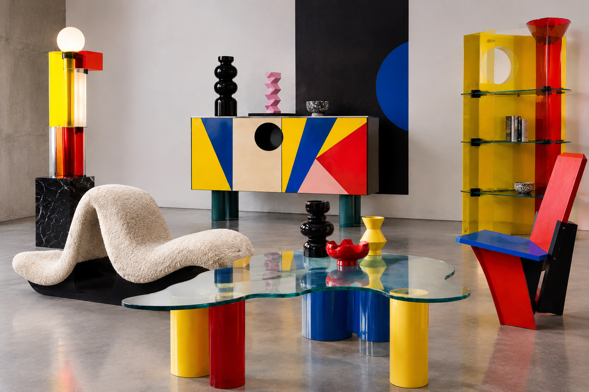
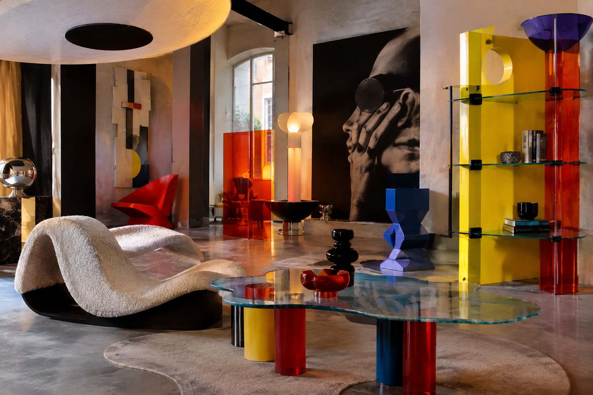

# Alchimia Design

## Historical Background

Studio Alchimia was an Italian design collective founded in Milan in 1976 by Alessandro and Adriana Guerriero. It became an important part of the Italian radical design movement of the 1970s and 1980s.

Alchimia developed during a period when designers were questioning the rules of Modernist and industrial design. Instead of focusing only on function and mass production, the group explored design as an expressive and artistic activity.

The group brought together designers including Alessandro Mendini, Ettore Sottsass, Andrea Branzi, and Lapo Binazzi. Alchimia used design, architecture, visual art, fashion, music, and performance to develop a more experimental approach to everyday objects.

## Main Characteristics

Alchimia Design is characterized by:

- Bold and unusual colors
- Decorative surfaces
- Unconventional forms
- Irony and humor
- Kitsch and playful visual references
- Experimental materials
- Small-scale or one-of-a-kind objects
- Mixing art and design
- Historical and cultural references
- Design that prioritizes expression over pure functionality

The group used inexpensive materials, strong colors, and decorative elements to transform ordinary objects into visually expressive pieces.

## How Alchimia Challenges Modernist Design

Modernist design often emphasized functionality, simplicity, industrial production, and restrained decoration.

Alchimia challenged these ideas by treating objects as expressive and symbolic works rather than only functional products. Its designers experimented with decoration, unusual forms, bright colors, and materials that did not necessarily follow traditional industrial-design principles.

The Metropolitan Museum of Art describes Studio Alchimia as a group founded in 1976 by designers who were rebelling against the functionalist approach of Modernism. Its designs were often prototypes or unique exhibition pieces rather than mass-produced products.

Alchimia therefore challenged the idea that good design needed to be simple, purely functional, and suitable for industrial mass production.

## When and Why Alchimia Design Is Used

Alchimia-inspired design can be used when a designer wants to:

- Make an object visually memorable
- Express an idea or concept
- Challenge traditional design rules
- Combine art and functional objects
- Use humor or irony
- Experiment with color and decoration
- Create a strong artistic identity
- Question conventional ideas about what design should be

## Practical Design Guidance

### Imagery

Alchimia-inspired imagery can include:

- Unusual furniture forms
- Decorative patterns
- Everyday objects transformed into art
- Abstract geometric shapes
- Unexpected combinations of materials
- Historical references
- Playful or ironic visual elements

### Colors

Use expressive and contrasting colors rather than relying only on neutral tones.

Possible choices include:

- Bright primary colors
- Pastel colors
- Yellow
- Pink
- Blue
- Green
- Orange
- Contrasting color combinations

### Typography

Typography can be expressive and experimental while remaining readable.

Possible approaches include:

- Bold display typefaces
- Geometric fonts
- Large headings
- Contrasting type sizes
- Playful arrangements
- Decorative typography

### Layout

Layouts can use:

- Asymmetry
- Unexpected spacing
- Geometric shapes
- Layering
- Contrasting elements
- Decorative backgrounds
- Visual tension
- Combinations of different styles

The overall design should feel experimental rather than strictly organized around a traditional Modernist grid.

## Images

### Alchimia Design Furniture

*AI-generated visual reference inspired by Alchimia Design, showing experimental furniture, bold colors, geometric forms, unusual materials, and the combination of art and functional design.*

### Alchimia Wave Lounge

*AI-generated visual reference inspired by Alchimia Design, showing sculptural furniture, unconventional forms, transparent materials, bold colors, and an experimental interior.*

## Real-World Examples

### The Structures Tremble

**Designer:** Ettore Sottsass  
**Manufacturer:** Studio Alchymia  
**Date:** 1979  
**Materials:** Plastic laminate, composition board, painted steel, rubber, and glass  
**Institution:** The Metropolitan Museum of Art

*The Structures Tremble* is an example of Alchimia's experimental approach to furniture. The Metropolitan Museum of Art describes the work as transforming everyday materials into an art object.

The table combines glass and steel tubing with undulating forms and pastel colors. Its unusual appearance contrasts with the restrained functionalism associated with Modernist design.

[The Metropolitan Museum of Art — The Structures Tremble](https://www.metmuseum.org/art/collection/search/484945)

### Svincolo Lamp

**Designer:** Ettore Sottsass  
**Design house:** Studio Alchimia  
**Date:** 1979  
**Materials:** Laminate, chrome-plated steel, and fluorescent tubes  
**Institution:** Museum of Fine Arts, Houston

The *Svincolo Lamp* demonstrates Alchimia's use of unconventional materials and expressive forms. The Museum of Fine Arts, Houston identifies the work as part of its Dennis Freedman Collection of Italian Radical Design.

[The Museum of Fine Arts, Houston — Svincolo Lamp](https://emuseum.mfah.org/objects/141451/svincolo-lamp-from-the-bau-haus-collection)

## Why Alchimia Is Postmodernist

Alchimia is connected to Postmodernist design because it rejected the idea that design needed to follow one strict functional or visual system.

Its use of decoration, irony, bright colors, unusual forms, historical references, and combinations of art and design reflects the Postmodernist interest in complexity and experimentation.

Rather than completely rejecting decoration and historical references, Alchimia used them as important parts of the design.

The Metropolitan Museum of Art identifies Studio Alchimia as part of the Italian antidesign movement that developed in opposition to the pure functionalism of the International Style.

## Sources

- [ADI Design Museum — Alchimia: The Revolution of Italian Design](https://www.adidesignmuseum.org/en/exhibition-categories/temporary-exhibition/alchimia-la-rivoluzione-del-design-italiano/)
- [Bröhan Museum — Alchimia: The Revolution of Italian Design](https://www.broehan-museum.de/en/exhibition/alchimia-the-revolution-of-italian-design/)
- [The Metropolitan Museum of Art — The Structures Tremble](https://www.metmuseum.org/art/collection/search/484945)
- [The Metropolitan Museum of Art — Design, 1975–2000](https://www.metmuseum.org/essays/design-1975-present)
- [Museum of Fine Arts, Houston — Svincolo Lamp](https://emuseum.mfah.org/objects/141451/svincolo-lamp-from-the-bau-haus-collection)

## Image Credits

Images should be credited to the museum, archive, or collection that provides them. Follow the copyright and image-use requirements listed by the original source.

[Back to Postmodernist Design](README.md)

[Back to Main README](../README.md)