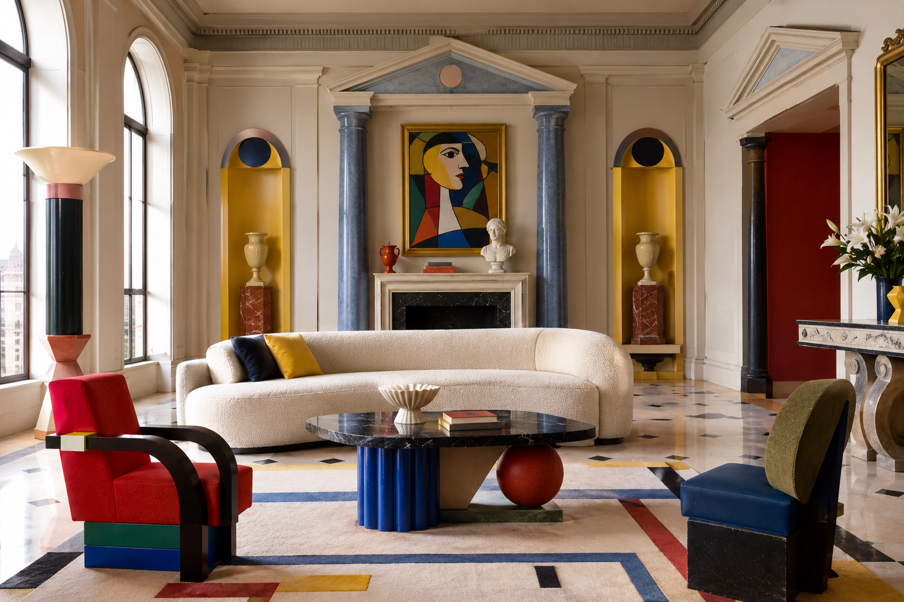
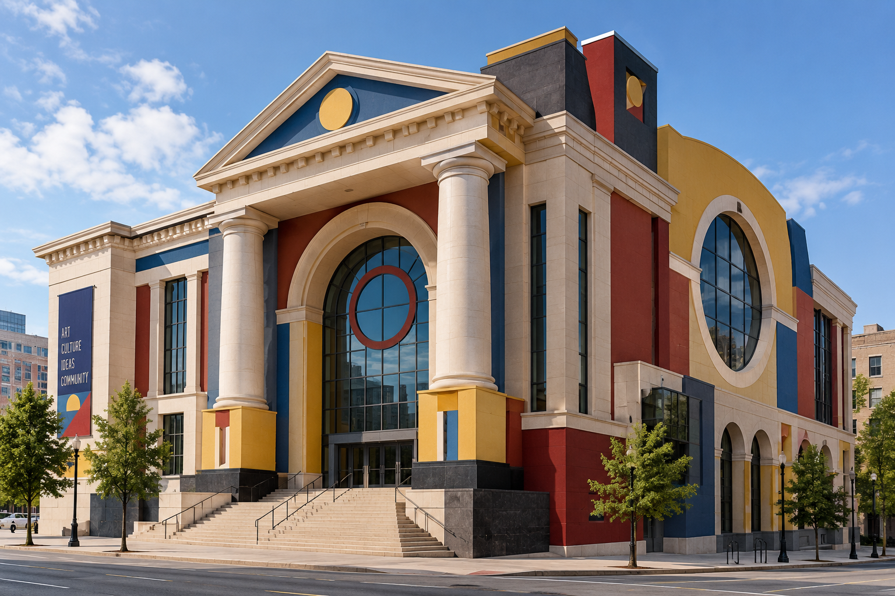

# Neoclassical PoMo Design

## Historical Background

Neoclassical PoMo Design is a Postmodern approach to architecture that reuses classical architectural elements in new and sometimes exaggerated ways.

Postmodern architecture developed partly as a reaction against the simplicity and strict functionalism associated with Modernist architecture. Architects began bringing historical references, decoration, symbolism, and visual complexity back into architectural design.

Robert Venturi was an important figure in this development. His 1966 book, *Complexity and Contradiction in Architecture*, criticized the idea that architecture should always be simple and consistent. His work combined classical and historical references with modern architectural elements.

The Vanna Venturi House, designed by Robert Venturi for his mother in Philadelphia between 1962 and 1964, became an important early example of this approach.

## Main Characteristics

Neoclassical PoMo Design can include:

- Classical columns
- Pediments
- Arches
- Symmetrical or intentionally distorted forms
- Historical references
- Geometric shapes
- Decorative elements
- Bold colors
- Oversized architectural details
- Mixing traditional and modern forms
- Visual irony
- Multiple meanings and references

The style does not simply copy classical architecture. Instead, classical elements can be simplified, exaggerated, rearranged, or combined with modern forms.

## How Neoclassical PoMo Challenges Modernist Design

Modernist architecture often emphasized functionalism, simplicity, clean geometric forms, and the removal of historical decoration.

Neoclassical Postmodern architecture challenged these ideas by bringing historical references and decoration back into architectural design.

Robert Venturi argued against the reduction of architecture to simplicity and consistency. His work explored contradictions such as big and small, open and closed, and traditional and modern elements.

The Vanna Venturi House demonstrates this approach through its combination of a conventional-looking gable and chimney with distorted symmetry, classical references, and modern elements.

## When and Why Neoclassical PoMo Design Is Used

Neoclassical PoMo Design can be used when architects want to:

- Reference historical architecture
- Create a recognizable identity
- Add symbolism or meaning
- Combine traditional and contemporary ideas
- Make architecture more visually expressive
- Challenge expectations about modern architecture
- Create buildings with multiple visual references

## Practical Design Guidance

### Imagery

Use architectural imagery that includes:

- Columns
- Pediments
- Arches
- Classical façades
- Geometric shapes
- Historical architectural details
- Modern materials combined with traditional forms
- Exaggerated or oversized elements

### Colors

Postmodern architecture can use stronger colors than traditional Neoclassical architecture.

Possible colors include:

- White
- Beige
- Gray
- Blue
- Red
- Yellow
- Green
- Pastel colors

Color can be used to emphasize individual architectural elements.

### Typography

Typography for a Neoclassical PoMo design can combine traditional and modern influences.

Possible choices include:

- Serif fonts for historical references
- Sans-serif fonts for contemporary contrast
- Large architectural-style headings
- Contrasting type sizes
- Simple, readable body text

### Layout

Layouts can combine order with unexpected elements.

Possible approaches include:

- Symmetry mixed with asymmetry
- Geometric blocks
- Strong vertical and horizontal lines
- Classical shapes combined with modern forms
- Contrasting proportions
- Layered architectural elements

The goal is to create visual complexity without making the design impossible to understand.

## Images

### Neoclassical PoMo Interior

*AI-generated visual reference inspired by Neoclassical Postmodern design, showing classical architectural elements combined with modern forms, geometric shapes, bold colors, and decorative details.*

### Neoclassical PoMo Exterior

*AI-generated visual reference inspired by Neoclassical Postmodern architecture, showing classical columns, geometric forms, exaggerated proportions, and a combination of traditional and contemporary elements.*

## Real-World Examples

### Vanna Venturi House

**Architect:** Robert Venturi  
**Location:** Philadelphia, Pennsylvania  
**Date:** 1962–1964

The Vanna Venturi House was designed by Robert Venturi for his mother. The building uses recognizable elements of a conventional house, including a large gable, chimney, front door, and windows, but combines them with distorted symmetry and contrasting architectural references.

MoMA identifies the house as one of the earliest demonstrations of Venturi's influential ideas about architectural complexity and contradiction.

The building combines references to classical and Mannerist architecture, International Style Modernism, and 19th-century American architecture.

[The Museum of Modern Art — Vanna Venturi House](https://www.moma.org/collection/works/990)

### Portland Building

**Architect:** Michael Graves  
**Location:** Portland, Oregon  
**Date:** 1982

The Portland Building is a well-known example of Postmodern architecture. Michael Graves used geometric forms, strong colors, and historical architectural references rather than following the restrained appearance of International Style Modernism.

The building's decorative façade and simplified classical references demonstrate the Postmodern interest in symbolism and visual expression.

## Why Neoclassical PoMo Is Postmodernist

Neoclassical PoMo is Postmodernist because it combines historical architectural references with modern forms rather than following the strict simplicity associated with Modernism.

The style can use classical columns, pediments, arches, and other historical elements while changing their scale, proportions, colors, or context.

Robert Venturi's work is particularly important to Postmodernism because he rejected the idea that architecture should always be reduced to simple and consistent forms.

His Vanna Venturi House demonstrates how classical references, modern elements, and deliberately contradictory forms can exist together in one building.

## Sources

- [The Museum of Modern Art — Robert Venturi](https://www.moma.org/artists/6132-robert-venturi)
- [The Museum of Modern Art — Vanna Venturi House](https://www.moma.org/collection/works/990)
- [The Museum of Modern Art — Robert Venturi, Denise Scott Brown: Queen Anne Side Chair](https://www.moma.org/collection/works/3238)
- [The Museum of Modern Art — Less Is a Bore: Postmodernism, Punk, and New Wave](https://www.moma.org/calendar/events/74)

## Image Credits

Images should be credited to the museum, archive, architect, photographer, or other institution that provides the image. Follow the copyright and image-use requirements listed by the original source.

[Back to Postmodernist Design](README.md)

[Back to Main README](../README.md)