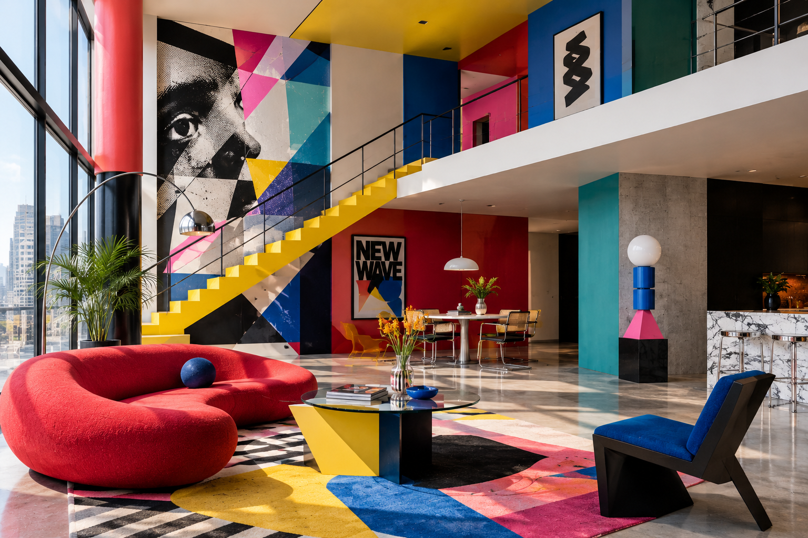
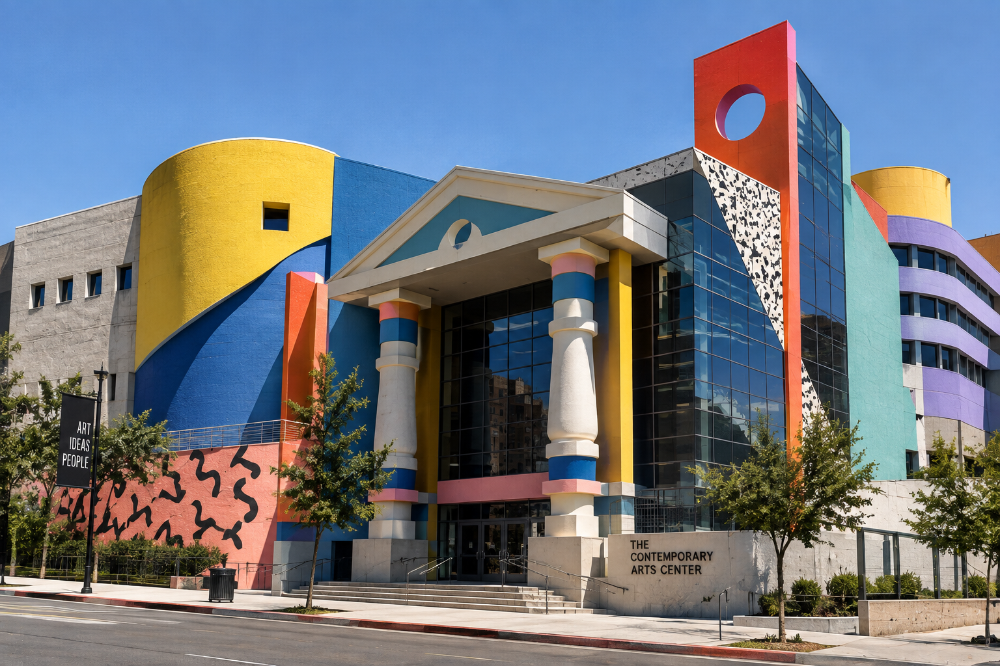

# New Wave Design

## Historical Background

New Wave Design developed in graphic design during the late 1970s and 1980s as designers began challenging the strict rules of Modernist and Swiss graphic design.

Modernist graphic design often emphasized clean layouts, grids, sans-serif typography, simplicity, and clear communication. New Wave designers experimented with breaking these rules by using unusual typography, overlapping elements, texture, color, and more expressive compositions.

Wolfgang Weingart was an important influence on this development. Beginning in the late 1960s, Weingart experimented with unconventional typography and challenged established rules of Swiss typography.

In California, designers including April Greiman and Jayme Odgers developed what became known as California New Wave. Their work combined photography, typography, color, texture, and emerging digital technologies.

## Main Characteristics

New Wave Design is characterized by:

- Experimental typography
- Breaking traditional grids
- Diagonal or rotated text
- Overlapping images and text
- Layered compositions
- Bold colors
- Textures and patterns
- Mixed typefaces
- Photographic elements
- Distorted or fragmented imagery
- Asymmetrical layouts
- Early digital experimentation

Typography is especially important in New Wave Design. Instead of treating type only as information, designers could use letters and words as visual elements.

## How New Wave Challenges Modernist Design

Modernist graphic design often emphasized order, simplicity, clarity, and consistency.

New Wave challenged these ideas by making graphic design more experimental and expressive. Designers broke traditional grids, mixed typefaces, layered elements, and used visual effects that could make a design more complex or difficult to read.

Wolfgang Weingart's experiments challenged the established rules of Swiss typography. His work replaced the simplicity and order of traditional Swiss design with more complex combinations of typography, photographs, patterns, and overlapping elements.

April Greiman also challenged Modernist conventions by using diagonal typography, bright colors, photography, digital imagery, and layered compositions.

## When and Why New Wave Design Is Used

New Wave Design can be used when a designer wants to:

- Create an energetic visual identity
- Express personality or emotion
- Challenge traditional design conventions
- Make typography a major visual element
- Create experimental posters or publications
- Connect design with music or popular culture
- Explore new technologies
- Create a visually unconventional composition

The style is especially useful when strict simplicity is not the main goal and the designer wants the visual design itself to attract attention.

## Practical Design Guidance

### Imagery

New Wave-inspired imagery can include:

- Photographs
- Abstract shapes
- Layered images
- Distorted photographs
- Textures
- Geometric patterns
- Photocopied or scanned elements
- Digital graphics
- Experimental compositions

### Colors

New Wave designs can use strong and contrasting colors.

Possible choices include:

- Bright yellow
- Orange
- Pink
- Blue
- Purple
- Green
- Black and white
- High-contrast color combinations

Color can be used to create energy and separate overlapping visual elements.

### Typography

Typography is one of the most important parts of New Wave Design.

Possible approaches include:

- Mixing different typefaces
- Using diagonal text
- Changing type size
- Rotating letters or words
- Overlapping text
- Using type as an image
- Combining serif and sans-serif fonts
- Distorting or fragmenting typography

Typography should be experimental, but important information should still be understandable when necessary.

### Layout

New Wave layouts can use:

- Broken grids
- Asymmetry
- Diagonal lines
- Overlapping elements
- Layered photographs
- Uneven spacing
- Unexpected alignment
- Large areas of visual texture

Instead of following a strict grid, elements can interact with each other to create movement and visual complexity.

## Images

### New Wave Interior

*AI-generated visual reference inspired by New Wave Design, showing experimental typography, bold colors, asymmetrical forms, layered elements, and unconventional graphic compositions.*

### New Wave Exterior

*AI-generated visual reference inspired by New Wave Design, showing geometric architecture, bold colors, asymmetrical forms, layered surfaces, and experimental visual elements.*

## Real-World Examples

### Does It Make Sense?

**Designer:** April Greiman  
**Date:** 1986  
**Publication:** Design Quarterly #133

*Does It Make Sense?* is one of April Greiman's best-known experimental graphic design works.

The piece combines photography, digital imagery, typography, and a large-format composition. Greiman used an early Macintosh computer as part of the design process.

The work demonstrates New Wave's interest in breaking traditional graphic design conventions. It combines text and images in unconventional ways and treats the page as a space for experimentation.

[The Museum of Modern Art — Does It Make Sense?](https://www.moma.org/collection/works/172729)

### Los Angeles 1984 Olympic Games

**Designers:** April Greiman and Jayme Odgers  
**Date:** 1984

Greiman and Odgers created a poster for the 1984 Los Angeles Olympic Games.

The design combined photography with an abstract visual background. Greiman described the project as an attempt to combine different technologies and textures, including photography and fine-art printing.

The poster is an example of California New Wave's use of photography, color, typography, and mixed visual techniques.

[The Museum of Modern Art — Los Angeles 1984 Olympic Games](https://www.moma.org/audio/playlist/298/4850)

## Why New Wave Is Postmodernist

New Wave is connected to Postmodernist design because it challenged the idea that graphic design should follow one strict system.

The style rejected the rigid grid systems and restrained appearance associated with Modernist Swiss typography. It instead allowed designers to mix typefaces, photography, textures, colors, and different visual influences.

New Wave also combined different cultural and technological influences. This reflects the broader Postmodern approach of mixing styles, challenging established rules, and using earlier conventions in new ways.

The Museum of Modern Art describes Postmodernism as a reaction against Modernism that can involve mixing different styles, mediums, and earlier conventions.

## Sources

- [The Museum of Modern Art — Postmodernism](https://www.moma.org/collection/terms/postmodernism)
- [The Museum of Modern Art — April Greiman](https://www.moma.org/artists/2330-april-greiman)
- [The Museum of Modern Art — Does It Make Sense?](https://www.moma.org/collection/works/172729)
- [The Museum of Modern Art — Los Angeles 1984 Olympic Games](https://www.moma.org/audio/playlist/298/4850)
- [AIGA Eye on Design — New Wave Graphics](https://eyeondesign.aiga.org/why-new-wave-graphics-are-the-most-influential-designs-youve-probably-ignored/)
- [Design Museum — Teacher Exhibition Notes](https://designmuseum.org/asset/download?id=0b1fead7-ca73-4b4c-bd84-f987df56fac6)

## Image Credits

Images should be credited to the museum, archive, designer, photographer, or other institution that provides the image. Follow the copyright and image-use requirements listed by the original source.

[Back to Postmodernist Design](README.md)

[Back to Main README](../README.md)