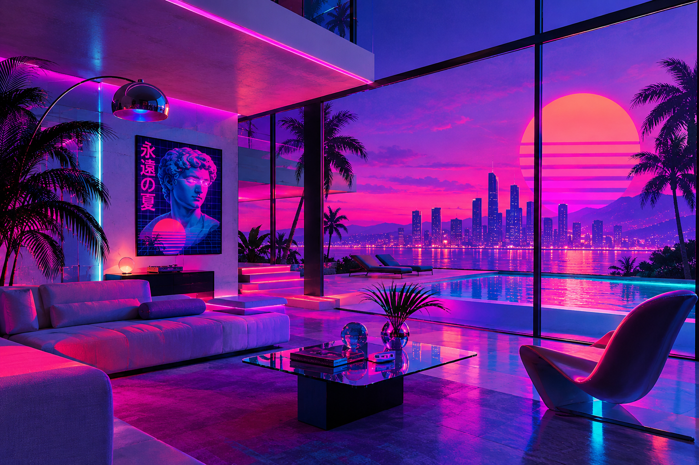
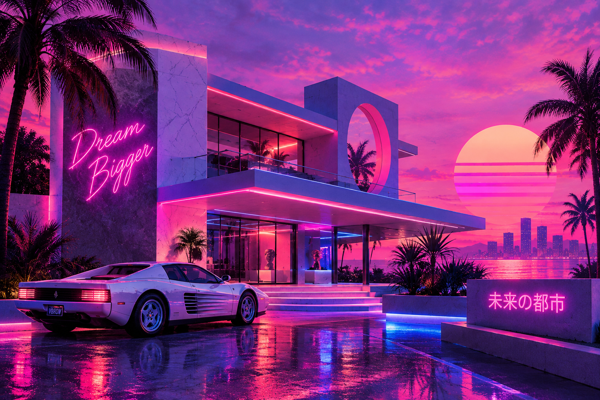

# Vaporwave & Synthwave Design

## Historical Background

Vaporwave and Synthwave are digital aesthetics that developed primarily through music, graphic design, and internet culture.

Synthwave developed during the 2000s and 2010s as artists and designers revisited the visual and musical styles associated with the 1980s. Its imagery often references neon lighting, futuristic technology, sports cars, sunsets, and science-fiction media.

Vaporwave developed around the early 2010s as an internet-based music and visual aesthetic. It often uses imagery from older technology, shopping malls, computer graphics, classical sculpture, advertisements, and 1980s and 1990s popular culture.

Both styles reuse and reinterpret older visual material rather than creating a completely new visual language. This connection to nostalgia, appropriation, and the mixing of different cultural references makes them useful examples when discussing later digital aesthetics influenced by Postmodern ideas.

## Main Characteristics

Vaporwave and Synthwave Design can include:

- Neon colors
- Pink, purple, blue, and cyan color schemes
- Retro computer graphics
- Digital grids
- Glowing effects
- Geometric shapes
- 1980s-inspired imagery
- Classical statues
- Palm trees
- Sports cars
- Sunsets
- VHS and CRT effects
- Pixelated or low-resolution graphics
- Glitch effects
- Retro technology
- References to advertisements and popular culture

Vaporwave often has a more surreal and ironic appearance, while Synthwave usually focuses more strongly on the futuristic and nostalgic imagery associated with 1980s science fiction.

## How Vaporwave Synthwave Challenges Modernist Design

Modernist design often emphasized simplicity, functional communication, clean forms, and consistent visual systems.

Vaporwave and Synthwave take a different approach by combining unrelated visual references and emphasizing nostalgia, atmosphere, and visual effects.

Vaporwave can combine classical sculptures with computer graphics, Japanese text, advertisements, and distorted digital effects. Synthwave can combine futuristic imagery with references to older technology and popular culture.

Instead of following one consistent design language, these aesthetics mix different periods and visual styles to create something new.

## When and Why Vaporwave & Synthwave Design Is Used

Vaporwave and Synthwave-inspired design can be used when a designer wants to:

- Create a retro or nostalgic atmosphere
- Reference 1980s or 1990s culture
- Create a futuristic visual identity
- Combine older and newer technology
- Create an experimental digital aesthetic
- Use irony or humor
- Create album artwork
- Design posters and digital graphics
- Create video game or entertainment branding
- Build an online or social-media visual identity

Synthwave is especially useful for futuristic and retro-futuristic themes, while Vaporwave works well for surreal, nostalgic, or intentionally strange concepts.

## Practical Design Guidance

### Imagery

Vaporwave-inspired imagery can include:

- Classical statues
- Shopping malls
- Old computers
- VHS tapes
- Japanese advertisements
- Palm trees
- Marble textures
- Glitch effects
- Early 3D graphics
- Retro consumer technology

Synthwave-inspired imagery can include:

- Sports cars
- Neon cityscapes
- Sunsets
- Digital grids
- Palm trees
- Stars
- Futuristic buildings
- Retro computers
- Science-fiction imagery

### Colors

Common colors include:

- Neon pink
- Purple
- Cyan
- Electric blue
- Magenta
- Orange
- Dark blue
- Black

Vaporwave designs often use pastel or fluorescent combinations, while Synthwave designs often use strong neon colors against dark backgrounds.

### Typography

Typography can use:

- Retro display fonts
- Geometric sans-serif fonts
- Italic fonts
- Large text
- Neon or glowing text effects
- Outlined lettering
- Distorted typography
- Retro computer-inspired type

Typography can be exaggerated or stylized to strengthen the retro-futuristic appearance.

### Layout

Layouts can use:

- Digital grids
- Symmetrical compositions
- Layered imagery
- Glitch effects
- Large central objects
- Neon gradients
- Overlapping text
- Repeated patterns
- Strong perspective

A Vaporwave layout can intentionally feel strange or disconnected, while a Synthwave layout often uses strong perspective and depth to create a futuristic scene.

## Images

### Vaporwave & Synthwave Interior

*AI-generated visual reference inspired by Vaporwave and Synthwave Design, showing neon colors, retro-futuristic furniture, digital grids, geometric forms, and nostalgic 1980s-inspired imagery.*

### Vaporwave & Synthwave Exterior

*AI-generated visual reference inspired by Vaporwave and Synthwave Design, showing neon lighting, futuristic architecture, digital grids, glowing colors, and retro-futuristic visual elements.*

## Real-World Examples

### Macintosh Plus — Floral Shoppe

**Artist:** Macintosh Plus  
**Year:** 2011  
**Type:** Music album

*Floral Shoppe* is one of the best-known examples associated with the early Vaporwave aesthetic.

Its cover combines a classical Greek bust with a pink background, Japanese characters, and other visual references. The combination of classical imagery, digital culture, and unusual typography demonstrates how Vaporwave mixes references from different periods and cultures.

The album became strongly associated with the visual identity of Vaporwave and helped establish many of the aesthetic conventions later used in Vaporwave artwork.

### Synthwave Album and Poster Design

Synthwave artwork commonly uses imagery inspired by 1980s science fiction, technology, and popular culture.

Typical compositions combine neon sunsets, glowing grids, sports cars, futuristic buildings, and large retro typography. These designs reinterpret older ideas about the future through a modern digital aesthetic.

The style has also been widely used for music artwork, posters, video games, and entertainment graphics.

## Why Vaporwave Synthwave Is Postmodernist

Vaporwave and Synthwave are not historical Postmodernist movements in the same way as Memphis Design or New Wave. They developed much later through internet culture and digital media.

However, they can be connected to Postmodern design because they use several ideas associated with Postmodernism.

Both aesthetics mix references from different periods and cultures instead of following one consistent visual system. Vaporwave especially uses appropriation, nostalgia, irony, and unexpected combinations of imagery.

This approach reflects the broader Postmodern interest in questioning established design rules and combining different cultural references.

Vaporwave can place classical sculpture, consumer products, computer graphics, and popular culture in the same composition. Synthwave similarly reuses older ideas about technology and the future and transforms them into a contemporary digital aesthetic.

Therefore, Vaporwave and Synthwave are best understood as **later digital aesthetics that share some Postmodern characteristics**, rather than as original Postmodern movements.

## Sources

- [The Museum of Modern Art — Less Is a Bore: Postmodernism, Punk, and New Wave](https://www.moma.org/calendar/events/74)
- [The Museum of Modern Art — Making Music Modern: Design for Ear and Eye](https://www.moma.org/calendar/exhibitions/1473)
- [The Design Museum — Peter Saville](https://designmuseum.org/designers/peter-saville)
- [The Museum of Modern Art — Template Gothic](https://www.moma.org/collection/works/139319)

## Image Credits

Images should be credited to the artist, designer, museum, archive, photographer, or other institution that provides the image. Follow the copyright and image-use requirements listed by the original source.

[Back to Postmodernist Design](README.md)

[Back to Main README](../README.md)